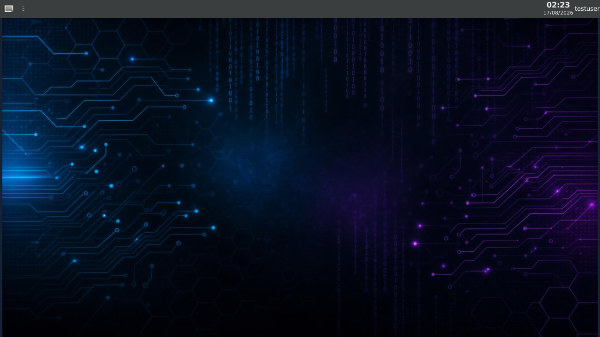
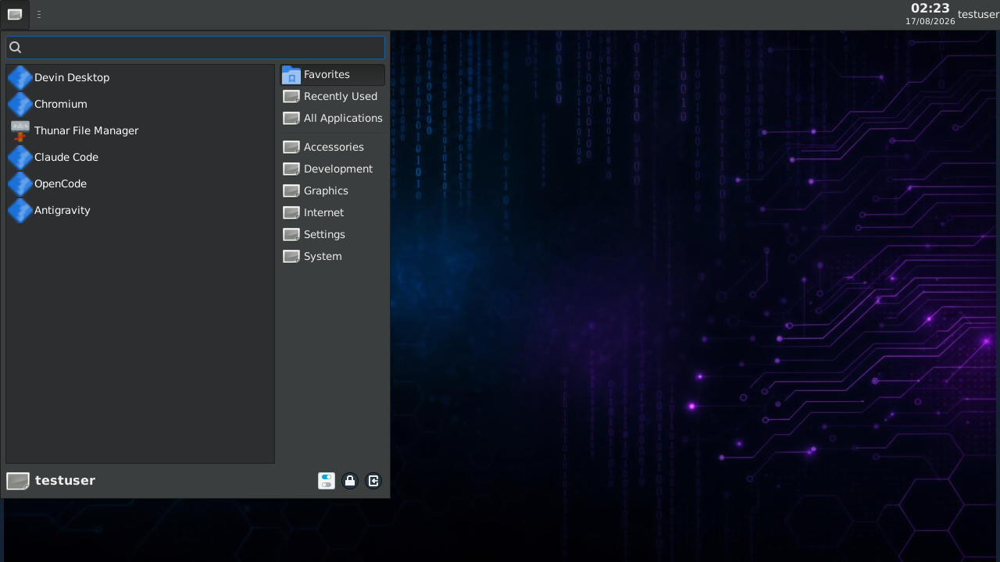

<p align="center">

</p>

<p align="center">


</p>

<p align="center">


<a href="https://github.com/afonsoft/modded-ubuntu/actions/workflows/shellcheck.yml"></a>
</p>

<p align="center"><b>Execute o Ubuntu com interface gráfica (XFCE4) dentro do Termux no Android.</b></p>
<p align="center"><i>Run Ubuntu with a graphical desktop (XFCE4) inside Termux on Android.</i></p>

---

## Sobre / About

O **modded-ubuntu** é um ambiente Ubuntu personalizado e otimizado para rodar em dispositivos Android através do [Termux](https://termux.com/) e do [PRoot](https://proot-me.github.io/). Este repositório é uma **versão modificada no Brasil**, mantida por [Afonso Dutra](https://github.com/afonsoft), com foco em desenvolvimento, produtividade e pentest no ecossistema mobile.

> **modded-ubuntu** is a customized Ubuntu environment designed to run on Android devices via [Termux](https://termux.com/) and [PRoot](https://proot-me.github.io/). This repository is a **Brazilian-modified version**, maintained by [Afonso Dutra](https://github.com/afonsoft), focused on development, productivity, and mobile pentesting.

## Recursos / Features

- Saída de áudio corrigida / Fixed audio output
- Leve — a partir de ~3 GB de armazenamento (5 GB+ recomendado para dev tools e navegadores) / Lightweight — from ~3 GB of storage (5 GB+ recommended for dev tools and browsers)
- Navegadores opcionais: Chromium e Mozilla Firefox / Optional browsers: Chromium and Mozilla Firefox
- Suporte a fontes e acentuação em português / Portuguese font and accent support
- VLC/MPV Media Player (opcional) / VLC/MPV media player (optional)
- Visual Studio Code (`arm64`/`aarch64` e x64; pulado em `armhf`/`armv7` 32-bit) / Visual Studio Code (arm64/aarch64 and x64; skipped on 32-bit armhf/armv7)
- Sublime Text Editor (`arm64`/`aarch64` e x64; pulado em `armhf`/`armv7` 32-bit) / Sublime Text Editor (arm64/aarch64 and x64; skipped on 32-bit armhf/armv7)
- OpenCode CLI/Desktop (opcional) / OpenCode CLI/Desktop (optional)
- Git + GitHub CLI (`gh`) (opcional) / Git + GitHub CLI (`gh`) (optional)
- Ferramentas essenciais de desenvolvimento (opcional) / Essential development tools (optional):
  - `build-essential`, `python3-pip`, `python3-venv`
  - `nodejs`, `npm`, `cmake`, `make`, `gcc`, `g++`
- .NET SDK 10.0 + ferramentas C# (opcional) / .NET SDK 10.0 + C# tooling (optional)
- Node.js LTS instalado diretamente via NodeSource .deb (sem NVM) / Node.js LTS installed directly via NodeSource .deb (no NVM)
- Angular (CLI mais recente) + extensões do VS Code (opcional) / Latest Angular CLI + VS Code extensions (optional)
- Instalação full-stack C# + Angular (opcional) / Full-Stack C# + Angular install option (optional)
- Assistentes de IA para código (opcionais) / AI coding assistants (optional):
  - **Claude Code CLI** (`claude`)
  - **Claude Desktop** (`claude-desktop`)
  - **Antigravity CLI** (`agy`)
  - **OpenCode CLI/Desktop** (`opencode` / `/opt/OpenCode`)
  - **Devin CLI** (`devin`)
  - **Devin Desktop** IDE (instalação via APT; depende da arquitetura do dispositivo)
- Fácil para iniciantes / Beginner-friendly
- Temas e cursores personalizados / Custom themes and cursors
- Instalador de ferramentas de segurança (modo minimal por padrão) / Security tools installer (minimal by default)
- Ghost Framework, Wireshark e GIMP (opcionais) / Ghost Framework, Wireshark and GIMP (optional)

## Requisitos / Requirements

- Android 8.0 ou superior / Android 8.0 or higher
- [Termux](https://termux.com/) instalado pelo F-Droid / [Termux](https://termux.com/) installed from F-Droid
- A partir de ~3 GB de armazenamento livre (5 GB+ recomendado para dev tools e navegadores) / From ~3 GB of free storage (5 GB+ recommended for dev tools and browsers)
- Conexão Wi-Fi recomendada para downloads grandes / Wi-Fi connection recommended for large downloads

## Instalação automática / One-liner installation

1. Instale o Termux pelo F-Droid: <a href="https://f-droid.org/repo/com.termux_118.apk">Download Termux 118</a>
2. Execute o comando abaixo no Termux: / Run the following single command in Termux:

```bash
curl -fsSL https://raw.githubusercontent.com/afonsoft/modded-ubuntu/master/install.sh | bash
```

Este comando atualiza os pacotes do Termux, instala `git`, `curl`, `wget`, `proot-distro` e `pulseaudio`, clona o repositório e executa o `setup.sh` automaticamente. O log completo é salvo em `~/modded-ubuntu-install.log`, então você pode acompanhar o progresso mesmo que o terminal pareça travado.

> This command updates Termux packages, installs `git`, `curl`, `wget`, `proot-distro` and `pulseaudio`, clones the repository and runs `setup.sh` automatically. The full log is saved to `~/modded-ubuntu-install.log` so you can check the progress if the terminal seems stuck.

## Instalação manual / Manual installation

Se preferir o método manual: / If you prefer the manual method:

1. Instale o Termux pelo F-Droid: <a href="https://f-droid.org/repo/com.termux_118.apk">Download Termux 118</a>
2. Atualize os pacotes e instale as dependências básicas: / Update packages and install basic dependencies:

```bash
yes | pkg up
pkg install git wget curl proot-distro pulseaudio -y
```

3. Clone este repositório: / Clone this repository:

```bash
git clone --depth=1 https://github.com/afonsoft/modded-ubuntu.git
cd modded-ubuntu
```

4. Execute o instalador: / Run the installer:

```bash
bash setup.sh
```

5. Reinicie o Termux e crie o usuário: / Restart Termux and create the user:

```bash
ubuntu
bash user.sh
```

   - Digite um nome de usuário root em minúsculas, sem espaços. / Type a lowercase root username with no spaces.
   - Opcionalmente, crie o usuário sem interação: / Optionally create the user non-interactively:
     ```bash
     MODDED_USER=meuuser MODDED_PASS=minhasenha bash user.sh
     ```

6. Reinicie o Termux novamente. / Restart Termux again.

7. Inicie a interface gráfica: / Start the graphical interface:

```bash
sudo bash gui.sh
```

8. O `vncstart` vai solicitar uma senha para o VNC na primeira execução (ou usar a senha padrão `modded` se estiver rodando sem TTY). / `vncstart` will ask for a VNC password on the first run (or use the default password `modded` if running without a TTY).

9. O Ubuntu está instalado. Use: / Ubuntu is installed. Use:

- `vncstart` — iniciar o VNC server / start VNC server
- `vncstop` — parar o VNC server / stop VNC server

10. Instale o [VNC VIEWER](https://play.google.com/store/apps/details?id=com.realvnc.viewer.android&hl=pt) no Android.
11. Abra o VNC VIEWER, clique em `+`, adicione o endereço `localhost:1` e dê um nome qualquer. / Open VNC VIEWER, tap `+`, enter the address `localhost:1` and give it any name.
12. Defina a qualidade da imagem como **Alta** para melhor qualidade. / Set Picture Quality to **High** for better quality.
13. Conecte-se e digite a senha. Aproveite! / Connect and enter the password. Enjoy!

### Atualizando o modded-ubuntu / Updating modded-ubuntu

Para atualizar os scripts VNC, pacotes do Ubuntu, configurações e o menu `gui.sh` sem reinstalar tudo: / To update VNC scripts, Ubuntu packages, settings, and the `gui.sh` menu without reinstalling everything:

- **Dentro do Ubuntu:** / **Inside Ubuntu:**

  ```bash
  sudo update-system
  ```

- **No Termux (atualiza o repositório e roda o `update-system` dentro do Ubuntu):** / **In Termux (updates the repository and runs `update-system` inside Ubuntu):**

  ```bash
  cd ~/modded-ubuntu && bash update.sh
  bash update.sh --with-desktops
  ```

  Ou diretamente pelo repositório remoto:

  ```bash
  curl -fsSL https://raw.githubusercontent.com/afonsoft/modded-ubuntu/master/update.sh | bash
  curl -fsSL https://raw.githubusercontent.com/afonsoft/modded-ubuntu/master/update.sh | bash -s -- --with-desktops
  ```

> O `update-system` baixa `vncstart`, `vncstop`, `vncstart-fhd` e `vncstart-qhd` direto do `master`, então qualquer correção recente já é aplicada automaticamente. / `update-system` downloads `vncstart`, `vncstop`, `vncstart-fhd`, and `vncstart-qhd` directly from `master`, so any recent fix is applied automatically.
>
> A partir desta versão, o `update-system` também re-executa o `gui.sh` em modo não interativo (`gui.sh --update`), garantindo que novos pacotes base (ex.: `mousepad`) e novas opções (ex.: **Obsidian**) sejam instalados em instalações existentes. / From this version onwards, `update-system` also re-runs `gui.sh` in non-interactive mode (`gui.sh --update`), ensuring new base packages (e.g., `mousepad`) and new options (e.g., **Obsidian**) are installed on existing setups.
>
> O update reaplica as extensões do VS Code, o papel de parede e os ícones da área de trabalho. Use `--with-desktops` para atualizar também os aplicativos desktop de IA.

### Acesso VNC na rede local

O `vncstart` continua usando o display `:1` e a porta `5901`, mas agora aceita conexões pela rede local. Em outra máquina conectada ao mesmo Wi-Fi, aponte o VNC Viewer para `<IP>:5901`. A senha padrão é `modded` quando nenhuma senha já foi definida; altere-a com `vncpasswd`.

Variáveis opcionais:

- `VNC_GEOMETRY` — define a resolução, por exemplo `2400x1080`.
- `VNC_DPI` — ajusta a densidade da interface; o padrão é `96`.
- `VNC_ZLIB_LEVEL` — controla a compressão, com padrão `0`, recomendado para a rede local.

Para melhor fluidez, mantenha o compositor do XFCE desligado. No VNC Viewer, ajuste a qualidade da imagem conforme a velocidade da rede e o desempenho desejado.

A interface usa uma barra superior com menu, janelas abertas, bandeja do sistema e relógio, além de um dock inferior centralizado no estilo macOS com atalhos para Home (Thunar), Firefox, Chromium, terminal e VS Code. O dock usa autohide inteligente e ícones de 40px. A translucidez dos painéis só aparece se o compositor do xfwm4 estiver ligado:

```bash
xfconf-query -c xfwm4 -p /general/use_compositing -s true
```

O compositor continua desligado por padrão para melhorar o desempenho no VNC.

### `vncstart` trava ou não retorna / `vncstart` hangs or does not return

Se o `vncstart` "travar" sem mostrar nada, o TigerVNC provavelmente está esperando uma senha interativamente. / If `vncstart` "hangs" with no output, TigerVNC is probably waiting for a password interactively.

A versão atual do `vncstart` já resolve isso: / The current version of `vncstart` already fixes this:

- Se houver um TTY, ele pergunta a senha de forma segura. / If a TTY is available, it securely prompts for a password.
- Se não houver TTY (por exemplo, auto-start no `.bashrc`), ele define a senha padrão `modded`. / If no TTY is available (e.g., auto-start in `.bashrc`), it sets the default password `modded`.

O arquivo de senha pode estar em `~/.vnc/passwd` ou em `~/.config/tigervnc/passwd`, dependendo da versão/configuração do TigerVNC. / The password file can be at `~/.vnc/passwd` or `~/.config/tigervnc/passwd`, depending on the TigerVNC version/configuration.

Para definir sua própria senha antes de iniciar: / To set your own password before starting:

```bash
vncpasswd
```

Para trocar a senha depois: / To change the password later:

```bash
vncstop
rm ~/.vnc/passwd ~/.config/tigervnc/passwd 2>/dev/null || true
vncstart
```

> Se você já tem uma instalação antiga, rode `sudo update-system` dentro do Ubuntu para atualizar todos os scripts. / If you already have an old installation, run `sudo update-system` inside Ubuntu to update all scripts.

## Dicas para o Termux / Termux tips

Para que a instalação longa (rootfs, Node.js, Angular, .NET, CLIs de IA etc.) termine sem ser interrompida:

- **Mantenha a tela ligada** durante o setup: o `install.sh` usa `termux-wake-lock`/`termux-wake-unlock` automaticamente quando o Termux:API está disponível.
- **Desative a otimização de bateria** do Termux e do Termux:API nas configurações do Android; isso evita que o sistema mate o processo em instalações longas (Android 12+).
- **Use Wi-Fi e carregador** — o download do rootfs e dos pacotes pode consumir bastante dados e bateria.
- **Permissão de armazenamento**: o setup executa `termux-setup-storage` se necessário. Aceite a permissão quando o Android perguntar.
- **Depois de instalar**, reinicie o Termux e use `ubuntu` para entrar no CLI, depois `sudo bash gui.sh` para o menu gráfico/ferramentas.

## Erro `[Process completed (signal 9) - press Enter]` / `[Process completed (signal 9) - press Enter]` error

Esse erro ocorre no Android 12+ (comum em aparelhos Samsung) quando o sistema Android mata a sessão do Termux com `SIGKILL`. Ele é causado pelo **Phantom Process Killer** do Android, que limita processos "fantasmas" em segundo plano a **32 no total** no sistema e também termina processos que usam muita CPU. Cargas pesadas — como compilar código, rodar o `vncserver`/proot-distro ou usar assistentes de IA — costumam disparar o limite.

> This error happens on Android 12+ (common on Samsung devices) when the Android OS force-kills the Termux session with `SIGKILL`. It is caused by the Android **Phantom Process Killer**, which limits background "phantom" processes to **32 total** system-wide and also terminates CPU-heavy processes. Heavy workloads — compiling code, running `vncserver`/proot-distro, or active AI workflows — usually trigger the limit.

### Soluções / Fixes

- **Script automático (apenas com root / automated script, rooted only):**
  - Execute no Termux: / Run in Termux:

  ```bash
  bash fix-signal9.sh
  ```

  - Com `--check` você apenas visualiza o estado atual: / Use `--check` to only see the current state:

  ```bash
  bash fix-signal9.sh --check
  ```

- **Android 14, 15, 16 e 17 / Samsung Galaxy S24, S25, S26 (One UI 6+):**
  - Ative as **Opções do desenvolvedor**: Configurações → Sobre o telefone → Informações do software → toque 7 vezes em **Número de compilação**.
  - Acesse **Configurações → Opções do desenvolvedor** e ative **Desativar restrições de processos filhos** (ou **Disable child process restrictions**).
  - No mesmo menu, desative **Suspender execução de apps em cache** (ou **Suspend execution for cached apps**).
  - Vá em **Configurações → Aplicativos → Termux → Bateria** e defina como **Irrestrita** (ou **Unrestricted**).
  - Reinicie o aparelho.

  > **Enable Developer Options:** Settings → About phone → Software information → tap **Build number** 7 times. Then go to **Settings → Developer Options** and enable **Disable child process restrictions** and disable **Suspend execution for cached apps**. Go to **Settings → Apps → Termux → Battery** and set it to **Unrestricted**, then reboot.

  - **Se não quiser usar a interface / If you prefer ADB:**

  ```bash
  adb shell "settings put global settings_enable_monitor_phantom_procs false"
  adb shell "/system/bin/device_config set_sync_disabled_for_tests persistent"
  adb shell "/system/bin/device_config put activity_manager_native_boot use_freezer false"
  adb shell "/system/bin/device_config put activity_manager max_phantom_processes 2147483647"
  ```

  - Reinicie o aparelho / Reboot the phone.

  - **Nota sobre Samsung One UI 8.x (Android 16) / Note on Samsung One UI 8.x (Android 16):**
    Em alguns aparelhos da linha Galaxy S com One UI 8.x, o Termux em segundo plano pode não usar os núcleos grandes (big cores) mesmo com a bateria em Irrestrito. Isso é uma limitação do escalonamento de CPU da Samsung e está sendo discutido no issue termux/termux-app#5086 — não há uma correção pelo lado do usuário atualmente.

    > On some Galaxy S devices with One UI 8.x, Termux in the background may not use the big cores even with battery set to Unrestricted. This is a Samsung CPU scheduling limitation discussed in termux/termux-app#5086 — there is no user-side fix currently.

- **Android 12, 12L e 13 (sem root / non-root):**
  - Ative a **Depuração USB** (USB debugging) nas Opções do desenvolvedor.
  - Conecte o celular a um PC com [Android Platform Tools](https://developer.android.com/tools/releases/platform-tools) e execute:
  - Enable **USB debugging** in Developer Options, connect the phone to a PC with [Android Platform Tools](https://developer.android.com/tools/releases/platform-tools), and run:

  ```bash
  # Android 12L e 13+
  adb shell "settings put global settings_enable_monitor_phantom_procs false"

  # Android 12
  adb shell "/system/bin/device_config set_sync_disabled_for_tests persistent; /system/bin/device_config put activity_manager max_phantom_processes 2147483647"
  ```

  - Reinicie o aparelho / Reboot the phone.

- **Aparelho com root / Rooted device:**
  - No Termux, execute com `su` e reinicie:
  - Run inside Termux with `su`, then reboot:

  ```bash
  # Android 12L e 13+
  su -c "settings put global settings_enable_monitor_phantom_procs false"

  # Android 12
  su -c "/system/bin/device_config set_sync_disabled_for_tests persistent; /system/bin/device_config put activity_manager max_phantom_processes 2147483647"
  ```

### Dicas para evitar / Tips to avoid

- **Mantenha a tela ligada** durante tarefas pesadas e não deixe o Termux rodar por longos períodos com a tela desligada.
- **Reduza tarefas em segundo plano** (compilações multi-thread, serviços etc.) se o aparelho não estiver rooteado e não puder desabilitar o phantom killer.
- **Use `termux-wake-lock`** para impedir que o Android durma o Termux durante instalações longas.
- **Em Samsung Galaxy S**, confirme que a bateria do Termux está **Irrestrita** e que **Suspender execução de apps em cache** está desativado nas Opções do desenvolvedor.

> **Keep the screen on** during heavy tasks and avoid leaving Termux running for long periods with the screen locked. **Reduce background tasks** (multi-threaded builds, services, etc.) if the device is unrooted and cannot disable the phantom killer. **Use `termux-wake-lock`** to prevent Android from sleeping Termux during long installs. **On Samsung Galaxy S**, make sure Termux battery is set to **Unrestricted** and **Suspend execution for cached apps** is disabled in Developer Options.

> **Atenção / Warning:** essas alterações podem ser revertidas por uma atualização do sistema. Reaplique os comandos se o erro voltar. / These changes may be reverted by a system update. Reapply the commands if the error returns.

## Performance e qualidade em Samsung S26 / dispositivos High-DPI

Para telas de alta resolução como o Samsung Galaxy S26, a geometria padrão do VNC pode parecer pequena ou borrada. O script `vncstart` lê a variável `VNC_GEOMETRY` e oferece dois presets otimizados:

| Comando | Resolução | Ideal para |
|---------|-----------|------------|
| `vncstart` | `1440x720` (padrão) | Equilíbrio de desempenho |
| `vncstart-fhd` | `2340x1080` | Dispositivos Full-HD+ |
| `vncstart-qhd` | `3088x1440` | Telas QHD+ como S26 Ultra |

Geometria personalizada: / Custom geometry:

```bash
VNC_GEOMETRY=2400x1080 vncstart
```

Dicas para melhor latência e qualidade no S26: / Tips for best quality and lowest latency on the S26:

- Use o preset que corresponda à resolução da tela no VNC Viewer.
- No VNC Viewer, defina **Picture Quality** para **High** e **Color Level** para **Full**.
- Execute `s26-optimize` dentro do Ubuntu para aplicar otimizações XFCE (desabilita compositor, ajusta DPI).
- Desabilite o compositor do XFCE se arrastar janelas parecer lento: `Settings Manager → Window Manager Tweaks → Compositor` e desmarque `Enable display compositing`.
- Desabilite animações do XFCE: `Settings Manager → Settings Editor → xfwm4` e defina `general/vblank_mode` para `off`.
- Use `-zliblevel 0` (já configurado) para conexões locais, reduzindo o uso de CPU.
- Mantenha o wake-lock ativo (`termux-wake-lock`) durante sessões longas.

## Capturas de tela / Screenshots

Interface XFCE com o papel de parede tecnologia, tema Greybird-dark, ícones Papirus-Dark e o menu Whisker com os lançadores favoritos (Devin Desktop, Chromium, Thunar, Claude Code, OpenCode, Antigravity, Firefox e LibreOffice quando instalados).

<p align="center">
  
</p>

<p align="center">
  
</p>

## Ferramentas de desenvolvimento / Development tools

Durante `sudo bash gui.sh` você pode instalar:

- **Visual Studio Code:** via repositório Microsoft APT (pulado em ARM 32-bit).
- **Chromium:** instalado pelo PPA XtraDeb, com um shim que aplica `--no-sandbox` e `--disable-gpu` no PRoot. Repositórios Debian não são adicionados ao `sources.list`.
- **OpenCode CLI:** Node.js LTS e `opencode-ai` global (`opencode`).
- **OpenCode Desktop:** pacote `.deb` oficial para amd64 e arm64, instalado em `/opt/OpenCode`.
- **Git + GitHub CLI (`gh`):** adiciona Git e o repositório oficial `gh`.
- **Essential Dev Stack:** `build-essential`, `python3-pip`, `python3-venv`, `nodejs`, `npm`, `cmake`, `make`, `gcc`, `g++`.
- **.NET SDK 10.0 + C# tooling:** instala o SDK 10.0 (se o pacote Ubuntu não estiver disponível, usa `dotnet-install.sh` como fallback), adiciona as ferramentas globais `dotnet-ef` e `dotnet-aspnet-codegenerator` em `/usr/local/bin`, e instala as extensões C# do VS Code: quando o editor está presente. Verifique com `dotnet --version` e `dotnet tool list --tool-path /usr/local/bin`.
- **AI Coding Assistants:**
  - **Claude Code CLI:** instala o pacote `@anthropic-ai/claude-code` globalmente (`claude`).
  - **Claude Desktop:** adiciona o repositório APT oficial e instala `claude-desktop` para amd64 e arm64.
  - **Antigravity CLI:** baixa e instala o binário nativo `agy` em `/usr/local/bin`.
  - **Devin CLI:** baixa o instalador do `devin`, remove a etapa `devin setup` para evitar o login durante a instalação, instala o binário e cria symlink em `/usr/local/bin`.
  - **Devin Desktop:** adiciona o repositório APT `windsurf-stable` e instala o pacote `devin-desktop`. Pode falhar em arquiteturas não suportadas pelo repositório.

## Ferramentas de segurança / Security tools

O instalador de ferramentas de segurança (`distro/tools.sh`) agora trabalha em **modo minimal por padrão**:

- **Modo minimal (`--minimal` ou padrão):** instala apenas ferramentas leves nas categorias Essential, Network, Web e Information Gathering.
- **Modo completo (`--full`):** instala o conjunto maior de ferramentas, incluindo `wireshark`, `tshark`, `wpscan`, `theharvester`, `cewl`, `amass`, `subfinder`, `ettercap-common`, `arpwatch`, `ncat`, `ndiff` e `zenmap`.
- As categorias **Vulnerability Analysis**, **Penetration Testing**, **Password Cracking**, **Exploitation**, **Miscellaneous**, **Additional** e **Metasploit Framework** foram removidas do fluxo para reduzir o espaço em disco.

No `gui.sh`, a opção `Kali Linux Tools` executa o `tools.sh --minimal`, evitando downloads grandes por padrão.

## Comandos úteis / Useful commands

| Comando | Descrição / Description |
|---------|------------------------|
| `ubuntu` | Entra no shell do Ubuntu / Enter Ubuntu shell |
| `vncstart` | Inicia o servidor VNC / Start VNC server |
| `vncstop` | Para o servidor VNC / Stop VNC server |
| `vncstart-fhd` | Inicia VNC em 2340x1080 / Start VNC at 2340x1080 |
| `vncstart-qhd` | Inicia VNC em 3088x1440 / Start VNC at 3088x1440 |
| `sudo update-system` | Atualiza scripts VNC e pacotes do Ubuntu / Update VNC scripts and Ubuntu packages |
| `s26-optimize` | Aplica otimizações para high-DPI / Apply high-DPI optimizations |
| `bash fix-signal9.sh` | Corrige erro signal 9 (Phantom Process Killer) / Fix signal 9 error (Phantom Process Killer) |
| `bash remove.sh` | Remove o Ubuntu modded / Remove the modded Ubuntu OS |

> O `update.sh` (na pasta `~/modded-ubuntu` do Termux) atualiza o repositório e executa o `update-system` dentro do Ubuntu. / `update.sh` (in the `~/modded-ubuntu` folder of Termux) updates the repository and runs `update-system` inside Ubuntu.

### Iniciar VNC automaticamente / Auto-start VNC Server

Para iniciar o VNC automaticamente ao fazer login: / If you want to automatically start the VNC server when you log in:

```bash
echo "vncstart" >> ~/.bashrc
```

## Tutorial / Video Tutorial

[](https://mega.nz/embed/QvIC1TLQ#3z27MRNPwANAg6JTtx1Ei8kDouOZsZgk00bg4TsJMNQ!1m)

## Changelog

Clique para ver o [Changelog](./CHANGELOG.md).

## Licença / License

Distribuído sob [Apache License 2.0](./LICENSE).

## Créditos / Credits

Este projeto utiliza a imagem Ubuntu fornecida pelo pacote `proot-distro` do Termux. Todo o crédito pela imagem base do Ubuntu vai para:

- [Termux Proot Distro](https://github.com/termux/proot-distro)

### Mantenedores / Maintainers

- **Modificado e mantido no Brasil por / Modified and maintained in Brazil by:** [Afonso Dutra Nogueira Filho](https://github.com/afonsoft)
- **Autores do projeto original / Original project authors:**
  - [Mustakim Ahmed](https://github.com/BDhackers009)
  - [Tahmid Rayat](https://github.com/htr-tech)
  - [Mahfuz-THBD](https://github.com/Mahfuz-THBD)
  - [MIDØ](https://github.com/Midohajhouj)

### Se gostou do projeto, deixe uma estrela! / If you like our work, don't forget to give a Star :)
