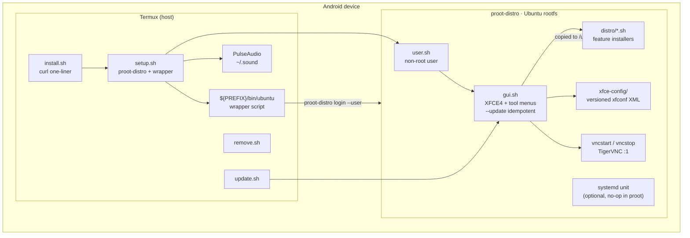
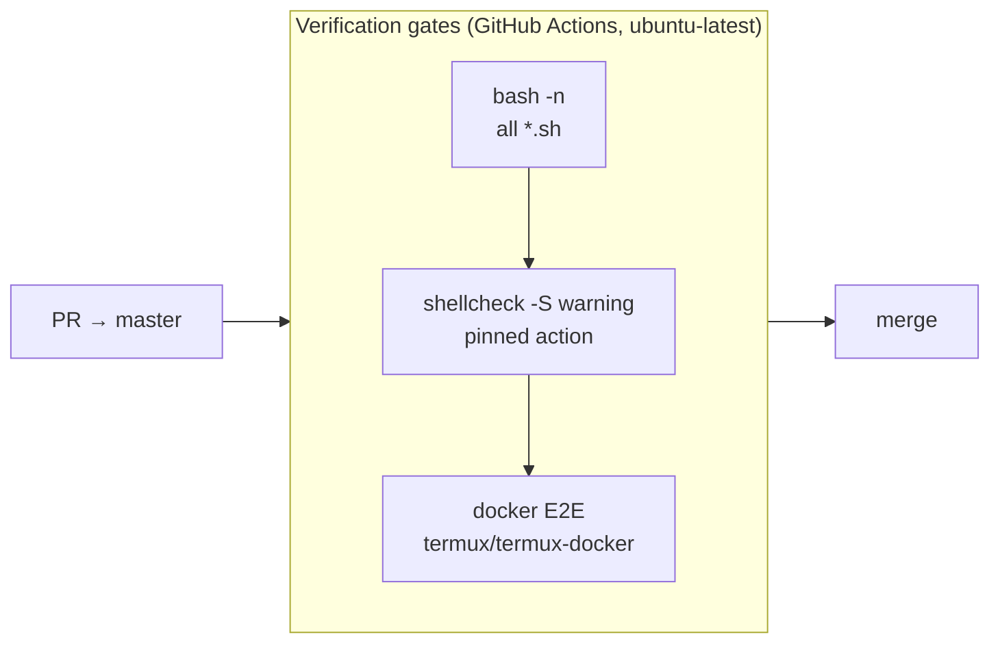

# docs/architecture/ — Architecture Decision Records

ADRs capture the *why* behind decisions that are expensive to reverse. Code shows *what*; these files explain *why this way* and *what was rejected*.

## System overview

## ADR index

| ADR | Decision | Status |
|---|---|---|
| [ADR-001](ADR-001-proot-distro-termux-runtime.md) | Ubuntu rootfs inside `proot-distro` on Termux | Accepted |
| [ADR-002](ADR-002-xfce4-tigervnc-desktop.md) | XFCE4 desktop served over TigerVNC | Accepted |
| [ADR-003](ADR-003-idempotent-install-pipeline.md) | Linear install pipeline + `--update` re-apply model | Accepted |
| [ADR-004](ADR-004-per-user-proot-wrapper.md) | Per-user `ubuntu` wrapper with non-root proot login | Accepted |
| [ADR-005](ADR-005-vnc-without-dbus.md) | VNC without external `dbus-launch` / systemd | Accepted |
| [ADR-006](ADR-006-chromium-xtradeb-no-sandbox.md) | Chromium via XtraDeb PPA + `--no-sandbox` shim | Accepted |
| [ADR-007](ADR-007-zsh-gitstatus-disabled.md) | zsh + Oh My Zsh + p10k with `gitstatus` disabled | Accepted |
| [ADR-008](ADR-008-xfce-config-versioned-xml.md) | Versioned xfconf XML + `xfce-apply --all` | Accepted |
| [ADR-009](ADR-009-add-apt-key-helper.md) | `add_apt_key` helper replacing deprecated `apt-key` | Accepted |
| [ADR-010](ADR-010-nodejs-nodesource-no-nvm.md) | Node.js via NodeSource `.deb`, NVM removed | Accepted — supersedes earlier NVM choice |
| [ADR-011](ADR-011-verification-gates.md) | bash -n + shellcheck + docker E2E as the test architecture | Accepted |

## Conventions

- One ADR per file, `ADR-{NNN}-{kebab-title}.md`, sequential numbering — never reuse a number.
- Lifecycle: `Accepted` → `Superseded by ADR-XXX` or `Deprecated`. Never delete an ADR.
- When a decision changes, write a **new** ADR that references the old one (see ADR-010).
- Every ADR cites the code/commits that prove the decision.
